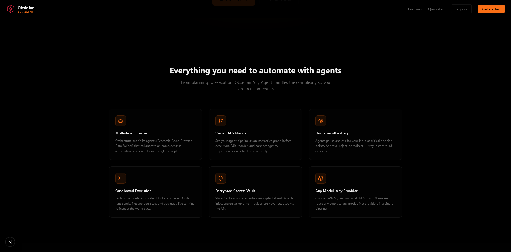

<div align="center">

# Obsidian Any Agent

### Open-Source Multi-Agent Automation Platform

Build, deploy, and orchestrate AI agent teams from a single prompt — with a visual DAG planner, sandboxed Docker execution, human-in-the-loop controls, and an encrypted secrets vault. Supports Anthropic Claude, OpenAI, Ollama, LM Studio, and any OpenAI-compatible endpoint.

[](LICENSE)
[](https://www.python.org/)
[](https://nextjs.org/)
[](https://fastapi.tiangolo.com/)
[](https://react.dev/)
[](https://tailwindcss.com/)
[](https://www.sqlite.org/)
[](https://www.mongodb.com/)

---

**Self-hosted · No vendor lock-in · Zero-config SQLite or MongoDB**

</div>

---



---

## Overview

Obsidian Any Agent is an open-source platform for orchestrating multi-agent AI workflows without writing orchestration code. Describe your task in plain English, review the auto-generated agent plan as a visual DAG, then execute it in an isolated Docker container — with the ability to pause, review, and steer at any point.

---

## Key Features

### Multi-Agent Orchestration
A Claude-powered orchestrator analyzes your task, selects specialist agents (Research, Code, Browser, Data, Writer, and more), assigns task-specific instructions, and produces an execution plan with explicit dependencies.

### Visual DAG Planner
The plan renders as an interactive node graph before execution. You can add, remove, edit, and reconnect agents, then approve or discard the plan entirely.

### Human-in-the-Loop (HITL)
Agents can pause mid-execution to ask clarifying questions or request approval before taking irreversible actions. You respond directly in the UI and execution resumes.

### Sandboxed Docker Execution
Each project gets a persistent, isolated Docker container. Agents run code, read and write files, and interact with the web — all safely contained. A live terminal gives you direct shell access to the workspace.

### Encrypted Secrets Vault
API keys and credentials are stored AES-encrypted at rest. Agents receive decrypted values at runtime via the `vault_key_inject` tool. Values are never returned by the API.

### Any Model, Any Provider
Route any agent to any model: Anthropic Claude, OpenAI GPT-4o/o-series, local LM Studio, or local Ollama. Mix providers within a single pipeline.

### Agent Library
Create and manage custom agent templates with specific instructions, tool configurations, and model overrides. Built-in base agents are always available; your custom agents appear in every plan.

### Artifact Management
All files written by agents are stored as GridFS artifacts. Browse, preview (text, markdown, images), download, and delete from the workspace panel. Upload input files for agents to use.

---

## Architecture

```
obsidian-anyagent/
├── backend/                  # FastAPI + Agno agent framework
│   ├── main.py               # App entry point, lifespan startup
│   ├── orchestrator.py       # Task planning → AgentTeamPlan
│   ├── executor.py           # Plan execution, streaming, cancellation
│   ├── model_router.py       # Multi-provider model routing
│   ├── routers/              # REST API endpoints
│   │   ├── auth.py           # JWT authentication
│   │   ├── projects.py       # Project CRUD
│   │   ├── runs.py           # Run lifecycle
│   │   ├── artifacts.py      # File management
│   │   ├── agents.py         # Agent library CRUD
│   │   ├── containers.py     # Docker container management
│   │   └── vault.py          # Encrypted secrets
│   ├── websocket/
│   │   ├── agent_ws.py       # Run streaming WebSocket
│   │   └── terminal_ws.py    # Live terminal WebSocket
│   ├── services/
│   │   └── container_service.py  # Docker SDK wrapper
│   ├── models_mongo.py       # MongoDB collections
│   ├── models_sqlite.py      # SQLite models
│   └── crypto_utils.py       # AES encryption helpers
│
├── frontend/                 # Next.js 16 + React 19
│   ├── app/
│   │   ├── home/             # Public landing page
│   │   ├── login/            # Authentication
│   │   ├── register/         # Account creation
│   │   ├── dashboard/        # Project list
│   │   ├── projects/[id]/    # Project workspace
│   │   ├── agents/           # Agent library management
│   │   └── vault/            # Secrets vault
│   ├── components/
│   │   ├── plan/             # DAG graph, agent nodes, palette
│   │   └── workspace/        # Chat, terminal, artifacts panels
│   ├── store/                # Zustand global state
│   ├── hooks/                # WebSocket streaming hooks
│   └── lib/api.ts            # Typed API client
│
├── docker-compose.yml        # Full stack deployment
└── backend/Dockerfile.base   # Agent sandbox base image
```

**Frontend**: Next.js 16, React 19, Tailwind CSS 4, shadcn/ui, Zustand, ReactFlow, Framer Motion, CryptoJS

**Backend**: FastAPI, Agno 2.5, Motor (MongoDB) / SQLAlchemy (SQLite), Docker SDK, GridFS

**Database**: Zero-config SQLite for development; MongoDB for production

---

## Quickstart

### Prerequisites

- [Docker](https://docs.docker.com/get-docker/) and Docker Compose
- For local dev: Python 3.12+ with [uv](https://github.com/astral-sh/uv) and Node.js 20+
- At least one model API key (Anthropic or OpenAI), or a local Ollama/LM Studio instance

### Option A — Docker Compose (recommended)

```bash
git clone https://github.com/sup3rus3r/obsidian-anyagent.git
cd obsidian-anyagent

# Configure environment
cp backend/.env.example backend/.env
cp frontend/.env.local.example frontend/.env.local
```

Edit `backend/.env` — set at minimum:
```env
ENCRYPTION_KEY=<openssl rand -hex 32>
JWT_SECRET_KEY=<openssl rand -hex 32>
ANTHROPIC_API_KEY=sk-ant-...
```

Edit `frontend/.env.local`:
```env
AUTH_SECRET=<openssl rand -base64 32>
NEXT_PUBLIC_ENCRYPTION_KEY=<same value as backend ENCRYPTION_KEY>
```

Build the agent sandbox base image (one-time):
```bash
docker build -f backend/Dockerfile.base -t obsidian-webdev-base:latest backend/
```

Start the stack:
```bash
docker compose up -d
```

Open **http://localhost:3000**.

### Option B — Local development

**Backend:**
```bash
cd backend
cp .env.example .env   # edit with your keys
uv sync
uv run uvicorn main:app --reload --port 8000
```

**Frontend** (new terminal):
```bash
cd frontend
cp .env.local.example .env.local   # edit as above
npm install
npm run dev
```

Open **http://localhost:3000**.

---

## Configuration

### Backend `.env`

| Variable | Required | Description |
|---|---|---|
| `ENCRYPTION_KEY` | Yes | 32-byte hex key for AES vault encryption |
| `JWT_SECRET_KEY` | Yes | 32-byte hex key for JWT signing |
| `ANTHROPIC_API_KEY` | No* | Anthropic API key (server-level fallback) |
| `OPENAI_API_KEY` | No* | OpenAI API key (server-level fallback) |
| `DATABASE_TYPE` | No | `sqlite` (default) or `mongo` |
| `MONGO_URL` | If mongo | MongoDB connection string |
| `MONGO_DB_NAME` | If mongo | Database name |
| `LMSTUDIO_BASE_URL` | No | LM Studio endpoint (default: `http://localhost:1234/v1`) |
| `OLLAMA_BASE_URL` | No | Ollama endpoint (default: `http://localhost:11434`) |

*At least one model key is required for agent runs. Users can also add keys via the Secrets Vault.

### Frontend `.env.local`

| Variable | Required | Description |
|---|---|---|
| `AUTH_SECRET` | Yes | NextAuth secret (generate: `openssl rand -base64 32`) |
| `NEXT_PUBLIC_ENCRYPTION_KEY` | Yes | Must match backend `ENCRYPTION_KEY` exactly |
| `AUTH_URL` | Yes | Frontend base URL (default: `http://localhost:3000`) |
| `NEXT_PUBLIC_API_URL` | Yes | Backend REST URL (default: `http://localhost:8000`) |
| `NEXT_PUBLIC_WS_URL` | Yes | Backend WebSocket URL (default: `ws://localhost:8000`) |

---

## Usage

### 1. Create a project
From the dashboard, click **New Project**. A Docker workspace container is provisioned automatically on first run.

### 2. Add secrets (optional)
Go to **Vault** and add your `ANTHROPIC_API_KEY` or any other API credentials. These are encrypted and injected into agent runs automatically — no need to expose them in prompts.

### 3. Start a run
Inside a project, type your task in the chat input and select a model. The orchestrator generates a plan and displays it as a node graph.

### 4. Review and edit the plan
Inspect each agent's role, instructions, and tools. Add agents from the palette, edit nodes inline, or remove nodes you don't need. Draw connections to set execution order.

### 5. Approve and execute
Click **Approve & Run**. Watch agents execute in real time — events stream into the log panel and per-agent status indicators update on the graph.

### 6. Human-in-the-Loop
If an agent triggers HITL, a prompt appears in the UI. Respond with Yes/No or typed input. Execution resumes immediately.

### 7. Download results
Open the **Files** panel to browse, preview, and download all artifacts produced by the run. Upload input files from the same panel for agents to work with.

---

## Agent Library

Navigate to **Agent Library** from the dashboard header to:

- View built-in base agents: ResearchAgent, CodeAgent, BrowserAgent, DataAgent, WriterAgent, FileAgent, APIAgent, ReviewerAgent, OrchestratorAgent
- Create custom agents with tailored instructions, tool sets, and per-agent model overrides
- Edit or delete custom agents

Custom agents appear alongside base agents in every plan's agent palette.

---

## Model Support

| Model ID | Provider | Notes |
|---|---|---|
| `claude-sonnet-4-6` | Anthropic | Default orchestrator model |
| `claude-opus-4-6` | Anthropic | Highest capability |
| `claude-haiku-4-5-20251001` | Anthropic | Fast, cost-effective |
| `gpt-4o` | OpenAI | |
| `gpt-5` | OpenAI | |
| `o3`, `o4-mini` | OpenAI | Reasoning models |
| `lmstudio/<model>` | Local | Routes to LM Studio |
| `ollama/<model>` | Local | Routes to Ollama |

---

## Security

- Passwords are bcrypt-hashed; never stored in plaintext
- JWT tokens signed with a configurable secret; configurable expiry
- Vault secrets AES-encrypted before storage; encrypted values never returned by the API
- AES payload encryption between frontend and backend (CryptoJS)
- Docker containers are isolated per project with no cross-project access
- Rate limiting configurable via `RATE_LIMIT_USER` and `RATE_LIMIT_API_CLIENT`

---

## Tech Stack

| Layer | Technologies |
|---|---|
| Frontend | Next.js 16, React 19, Tailwind CSS 4, shadcn/ui, Zustand, ReactFlow, Framer Motion |
| Backend | FastAPI, Agno 2.5, Motor, SQLAlchemy, GridFS |
| Auth | NextAuth v5, JWT, bcrypt |
| Agents | Agno framework, Docker SDK, async WebSocket streaming |
| Database | SQLite (dev) / MongoDB 7 (prod) |
| Deployment | Docker Compose, self-hosted |

---

## Contributing

Pull requests are welcome. For major changes, open an issue first to discuss what you'd like to change.

1. Fork the repository
2. Create a feature branch: `git checkout -b feature/my-feature`
3. Commit your changes: `git commit -m 'Add my feature'`
4. Push to the branch: `git push origin feature/my-feature`
5. Open a pull request

---

## License

[AGPL v3](LICENSE) — free to use, modify, and self-host. Commercial use requires compliance with AGPL terms.

---

<div align="center">
Built by <a href="https://github.com/sup3rus3r">sup3rus3r</a> · Part of the Obsidian toolchain
</div>
